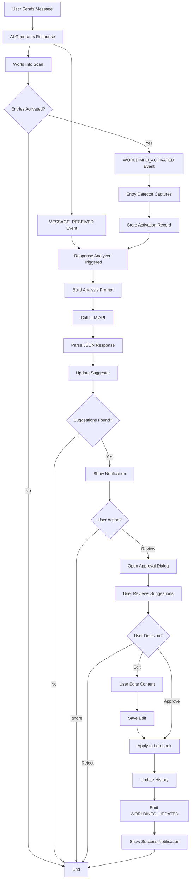
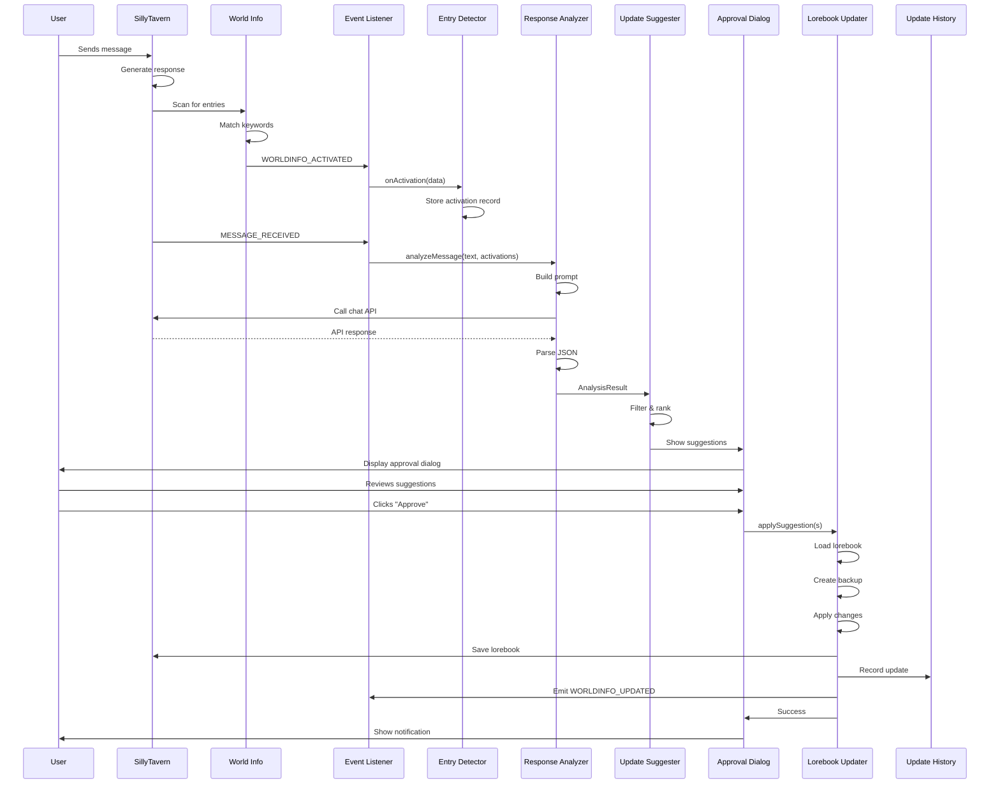
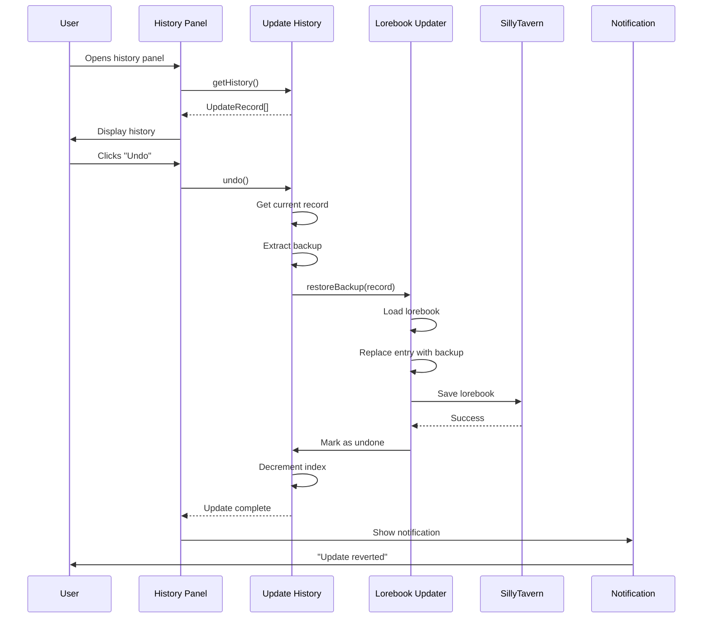
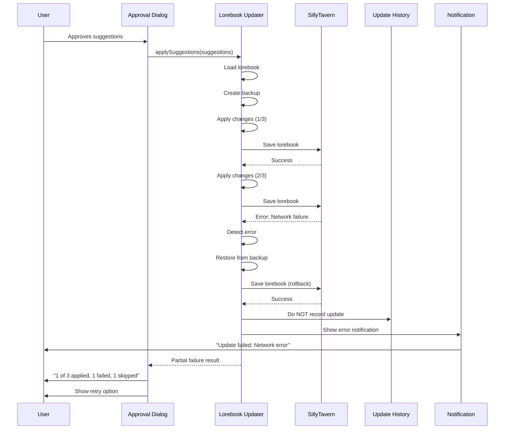

# Dynamic Lorebook Manager - System Diagrams

This document contains comprehensive system diagrams using both ASCII art and Mermaid diagram syntax for visualization.

## Table of Contents

1. [System Architecture Diagram](#system-architecture-diagram)
2. [Data Flow Diagrams](#data-flow-diagrams)
3. [Component Interaction Diagrams](#component-interaction-diagrams)
4. [Sequence Diagrams](#sequence-diagrams)
5. [State Machine Diagrams](#state-machine-diagrams)
6. [Class Diagrams](#class-diagrams)

---

## System Architecture Diagram

### High-Level System Architecture

```
┌─────────────────────────────────────────────────────────────────────────────────┐
│                            SillyTavern Core System                              │
│                                                                                 │
│  ┌──────────────────┐      ┌──────────────────┐      ┌──────────────────┐    │
│  │   Chat System    │      │  World Info      │      │  Prompt          │    │
│  │                  │─────▶│  System          │─────▶│  Generation      │    │
│  │  - Messages      │      │                  │      │                  │    │
│  │  - Characters    │      │  - Entry Scan    │      │  - Assembly      │    │
│  │  - Groups        │      │  - Activation    │      │  - Context       │    │
│  └──────────────────┘      │  - Insertion     │      │  - Formatting    │    │
│           │                 └──────────────────┘      └──────────────────┘    │
│           │                          │                         │               │
│           │    Event Bus (eventSource)                        │               │
│           └─────────────┬────────────┴─────────────────────────┘               │
│                         │                                                      │
└─────────────────────────┼──────────────────────────────────────────────────────┘
                          │
                          │ Events:
                          │ • WORLDINFO_ACTIVATED
                          │ • MESSAGE_RECEIVED
                          │ • GENERATION_STARTED
                          │ • WORLDINFO_UPDATED
                          │
                          ▼
┌─────────────────────────────────────────────────────────────────────────────────┐
│                    Dynamic Lorebook Manager Extension                           │
│                                                                                 │
│  ┌──────────────────────────────────────────────────────────────────────────┐  │
│  │                          Event Listener Layer                            │  │
│  │  - Subscribes to SillyTavern events                                      │  │
│  │  - Routes events to appropriate handlers                                 │  │
│  │  - Maintains event correlation                                           │  │
│  └────────────┬───────────────────────────────────────┬─────────────────────┘  │
│               │                                       │                         │
│               ▼                                       ▼                         │
│  ┌────────────────────────┐              ┌────────────────────────┐           │
│  │   Entry Detector       │              │  Response Analyzer     │           │
│  │                        │              │                        │           │
│  │  - Track activations   │──────────────▶  - Build prompts      │           │
│  │  - Cache entry data    │              │  - Call LLM API       │           │
│  │  - Correlate messages  │              │  - Parse results      │           │
│  └────────────┬───────────┘              └────────────┬───────────┘           │
│               │                                       │                         │
│               │         Activation Record             │ Analysis Result         │
│               │                                       │                         │
│               └───────────────────┬───────────────────┘                         │
│                                   ▼                                             │
│                      ┌────────────────────────┐                                │
│                      │  Update Suggester      │                                │
│                      │                        │                                │
│                      │  - Filter by config    │                                │
│                      │  - Rank suggestions    │                                │
│                      │  - Enrich metadata     │                                │
│                      └────────────┬───────────┘                                │
│                                   │                                             │
│                                   │ Suggestions                                 │
│                                   ▼                                             │
│                      ┌────────────────────────┐                                │
│                      │    UI Layer            │                                │
│                      │                        │                                │
│                      │  - Approval Dialog     │                                │
│                      │  - Diff Viewer         │                                │
│                      │  - Notifications       │                                │
│                      └────────────┬───────────┘                                │
│                                   │                                             │
│                                   │ User Decisions                              │
│                                   ▼                                             │
│                      ┌────────────────────────┐                                │
│                      │  Lorebook Updater      │                                │
│                      │                        │                                │
│                      │  - Validate changes    │                                │
│                      │  - Create backups      │                                │
│                      │  - Apply updates       │                                │
│                      │  - Save lorebooks      │                                │
│                      └────────────┬───────────┘                                │
│                                   │                                             │
│                                   ▼                                             │
│                      ┌────────────────────────┐                                │
│                      │  Update History        │                                │
│                      │                        │                                │
│                      │  - Record changes      │                                │
│                      │  - Enable undo/redo    │                                │
│                      │  - Export/import       │                                │
│                      └────────────────────────┘                                │
│                                   │                                             │
└───────────────────────────────────┼─────────────────────────────────────────────┘
                                    │
                                    ▼
                    ┌───────────────────────────┐
                    │  Storage Layer            │
                    │                           │
                    │  - LocalStorage (history) │
                    │  - World Info Files       │
                    │  - Extension Settings     │
                    └───────────────────────────┘
```

---

## Data Flow Diagrams

### 1. Complete Update Flow (End-to-End)



### 2. Activation Detection Flow

```
User Message
     │
     ▼
┌─────────────────┐
│ AI Generation   │
│ Starts          │
└────────┬────────┘
         │
         ▼
┌─────────────────┐
│ World Info      │
│ Scan Triggered  │
└────────┬────────┘
         │
         ▼
┌──────────────────────────────────────┐
│ For Each Active Lorebook:           │
│                                      │
│ ┌────────────────────────────────┐  │
│ │ Load Entries                   │  │
│ └────────┬───────────────────────┘  │
│          │                           │
│          ▼                           │
│ ┌────────────────────────────────┐  │
│ │ For Each Entry:                │  │
│ │                                │  │
│ │ • Check if disabled            │  │
│ │ • Check character filter       │  │
│ │ • Check generation trigger     │  │
│ │ • Check if constant            │  │
│ │ • Match keywords in buffer     │  │
│ │ • Apply probability            │  │
│ │ • Check budget                 │  │
│ └────────┬───────────────────────┘  │
│          │                           │
│          ▼                           │
│ ┌────────────────────────────────┐  │
│ │ Entry Activated?               │  │
│ └────────┬───────────────────────┘  │
│          │                           │
│          ├─Yes──▶ Add to Activated  │
│          │        List               │
│          │                           │
│          └─No───▶ Skip              │
│                                      │
└──────────────────┬───────────────────┘
                   │
                   ▼
         ┌─────────────────────┐
         │ All Entries Checked │
         └─────────┬───────────┘
                   │
                   ▼
         ┌─────────────────────┐
         │ Emit Event:         │
         │ WORLDINFO_ACTIVATED │
         │                     │
         │ Payload:            │
         │ • entries[]         │
         │ • scanState{}       │
         │ • timestamp         │
         └─────────┬───────────┘
                   │
                   ▼
         ┌─────────────────────┐
         │ Entry Detector      │
         │ Receives Event      │
         └─────────────────────┘
```

### 3. Analysis Flow

```
Activation Record + Message Text
            │
            ▼
┌───────────────────────────┐
│ Check Analysis Cache      │
│ Key: hash(message + ids)  │
└─────────┬─────────────────┘
          │
          ├─Hit──▶ Return Cached Result
          │
          └─Miss
            │
            ▼
┌───────────────────────────┐
│ Build Analysis Prompt     │
│                           │
│ Template:                 │
│ • System instructions     │
│ • Activated entries       │
│ • Message text            │
│ • Output format (JSON)    │
└─────────┬─────────────────┘
          │
          ▼
┌───────────────────────────┐
│ Detect API Type           │
│ (OpenAI/Claude/etc)       │
└─────────┬─────────────────┘
          │
          ▼
┌───────────────────────────┐
│ Call API Endpoint         │
│                           │
│ Settings:                 │
│ • Temperature: 0.3        │
│ • Max tokens: 1000        │
│ • Response: JSON          │
└─────────┬─────────────────┘
          │
          ▼
┌───────────────────────────┐
│ Receive API Response      │
└─────────┬─────────────────┘
          │
          ▼
┌───────────────────────────┐
│ Parse JSON                │
│                           │
│ Extract:                  │
│ • updates[]               │
│ • newEntities[]           │
│ • confidence scores       │
└─────────┬─────────────────┘
          │
          ├─Error──▶ Log & Return Empty
          │
          └─Success
            │
            ▼
┌───────────────────────────┐
│ Validate Structure        │
│                           │
│ • All required fields     │
│ • Confidence in range     │
│ • Entry UIDs exist        │
└─────────┬─────────────────┘
          │
          ▼
┌───────────────────────────┐
│ Cache Result              │
│ (LRU Cache, size: 100)    │
└─────────┬─────────────────┘
          │
          ▼
┌───────────────────────────┐
│ Return AnalysisResult     │
└───────────────────────────┘
```

### 4. Suggestion Generation Flow

```
AnalysisResult
     │
     ▼
┌──────────────────────────────┐
│ For Each Update:             │
│                              │
│ ┌──────────────────────────┐ │
│ │ Filter by Confidence     │ │
│ │ threshold                │ │
│ └────────┬─────────────────┘ │
│          │                   │
│          ├─Below──▶ Skip     │
│          │                   │
│          └─Above             │
│            │                 │
│            ▼                 │
│   ┌──────────────────────┐  │
│   │ Apply Aggressiveness │  │
│   │ Filter               │  │
│   │                      │  │
│   │ Conservative:        │  │
│   │ • Only expansions    │  │
│   │                      │  │
│   │ Balanced:            │  │
│   │ • Expansions         │  │
│   │ • Corrections        │  │
│   │                      │  │
│   │ Aggressive:          │  │
│   │ • All types          │  │
│   └────────┬─────────────┘  │
│            │                 │
│            ▼                 │
│   ┌──────────────────────┐  │
│   │ Check Enabled        │  │
│   │ Lorebooks            │  │
│   └────────┬─────────────┘  │
│            │                 │
│            ├─Not Enabled──▶ Skip
│            │                 │
│            └─Enabled         │
│              │               │
│              ▼               │
│     ┌──────────────────┐    │
│     │ Calculate Impact │    │
│     │ Score            │    │
│     │                  │    │
│     │ Factors:         │    │
│     │ • Tokens added   │    │
│     │ • Keywords added │    │
│     │ • Change type    │    │
│     └────────┬─────────┘    │
│              │               │
│              ▼               │
│     ┌──────────────────┐    │
│     │ Compute Diff     │    │
│     │ (diff-match-     │    │
│     │  patch lib)      │    │
│     └────────┬─────────┘    │
│              │               │
│              ▼               │
│     ┌──────────────────┐    │
│     │ Enrich with      │    │
│     │ Metadata         │    │
│     │                  │    │
│     │ • Source msg     │    │
│     │ • Timestamps     │    │
│     │ • UI state       │    │
│     └────────┬─────────┘    │
│              │               │
│              ▼               │
│     ┌──────────────────┐    │
│     │ Create           │    │
│     │ Suggestion       │    │
│     │ Object           │    │
│     └────────┬─────────┘    │
│              │               │
│              ▼               │
│        Add to List          │
│                              │
└──────────────┬───────────────┘
               │
               ▼
┌──────────────────────────────┐
│ Rank All Suggestions         │
│                              │
│ Sort by:                     │
│ 1. Confidence (desc)         │
│ 2. Impact (desc)             │
│ 3. Entry order (desc)        │
└──────────────┬───────────────┘
               │
               ▼
┌──────────────────────────────┐
│ Return Suggestion[]          │
└──────────────────────────────┘
```

### 5. Update Application Flow

```
Approved Suggestions
        │
        ▼
┌────────────────────────┐
│ Group by Lorebook      │
│ Name                   │
└────────┬───────────────┘
         │
         ▼
For Each Lorebook:
         │
         ▼
┌────────────────────────┐
│ Load Lorebook Data     │
│ (from cache or API)    │
└────────┬───────────────┘
         │
         ▼
┌────────────────────────┐
│ Start Transaction      │
│ (backup current state) │
└────────┬───────────────┘
         │
         ▼
For Each Suggestion in Lorebook:
         │
         ▼
┌─────────────────────────────┐
│ Find Target Entry by UID    │
└────────┬────────────────────┘
         │
         ├─Not Found──▶ Log Error
         │              & Continue
         │
         └─Found
           │
           ▼
┌─────────────────────────────┐
│ Create Entry Backup         │
│ (deep clone)                │
└────────┬────────────────────┘
         │
         ▼
┌─────────────────────────────┐
│ Apply Content Change        │
│ • Use edited or suggested   │
└────────┬────────────────────┘
         │
         ▼
┌─────────────────────────────┐
│ Update Keywords?            │
│ (if enabled in settings)    │
└────────┬────────────────────┘
         │
         ├─Yes──▶ Add/Remove Keywords
         │
         └─No
           │
           ▼
┌─────────────────────────────┐
│ Update Comment?             │
│ (if enabled & suggested)    │
└────────┬────────────────────┘
         │
         ▼
┌─────────────────────────────┐
│ Validate Entry              │
│ • Content not empty         │
│ • Keywords valid            │
│ • No circular refs          │
└────────┬────────────────────┘
         │
         ├─Invalid──▶ Rollback & Error
         │
         └─Valid
           │
           ▼
     Continue to Next
           │
           ▼
All Suggestions Processed
           │
           ▼
┌─────────────────────────────┐
│ Save Lorebook               │
│ (immediate save)            │
│                             │
│ POST /api/worldinfo/edit    │
└────────┬────────────────────┘
         │
         ├─Error──▶ Rollback All
         │          & Notify User
         │
         └─Success
           │
           ▼
┌─────────────────────────────┐
│ Record in History           │
│ • Before/after states       │
│ • Suggestion metadata       │
│ • Timestamp                 │
└────────┬────────────────────┘
         │
         ▼
┌─────────────────────────────┐
│ Emit Event:                 │
│ WORLDINFO_UPDATED           │
│                             │
│ source: 'extension'         │
└────────┬────────────────────┘
         │
         ▼
┌─────────────────────────────┐
│ Show Success Notification   │
│ "2 updates applied"         │
└────────┬────────────────────┘
         │
         ▼
┌─────────────────────────────┐
│ Clear Suggestions from UI   │
└─────────────────────────────┘
```

---

## Component Interaction Diagrams

### 1. Module Communication Map

```
┌──────────────────────────────────────────────────────────────────────────┐
│                       Extension Module Network                           │
│                                                                          │
│                                                                          │
│   EventListener                                                          │
│        │                                                                 │
│        ├────────▶ EntryDetector                                         │
│        │              │                                                  │
│        │              │ .onActivation(data)                             │
│        │              │ .getActivationsForMessage(id)                   │
│        │              │ .pruneHistory()                                 │
│        │              │                                                  │
│        │              └─────────┐                                        │
│        │                        │                                        │
│        ├────────▶ ResponseAnalyzer                                      │
│        │              │         │                                        │
│        │              │         │ Activation                             │
│        │              │◀────────┘ Record                                 │
│        │              │                                                  │
│        │              │ .analyzeMessage(text, activations)              │
│        │              │ .buildPrompt(...)                               │
│        │              │ .parseResult(...)                               │
│        │              │                                                  │
│        │              └─────────┐                                        │
│        │                        │                                        │
│        └──────────────────────┐ │                                        │
│                               │ │                                        │
│                               │ │ Analysis                               │
│                               │ │ Result                                 │
│                               ▼ ▼                                        │
│                          UpdateSuggester                                 │
│                               │                                          │
│                               │ .generateSuggestions(analysis)           │
│                               │ .filterByConfidence(...)                 │
│                               │ .rankSuggestions(...)                    │
│                               │                                          │
│                               └─────────┐                                │
│                                         │                                │
│                                         │ Suggestions                    │
│                                         │                                │
│                                         ▼                                │
│                                    UI Layer                              │
│                           ┌──────────────────────┐                      │
│                           │  - ApprovalDialog    │                      │
│                           │  - DiffViewer        │                      │
│                           │  - NotificationMgr   │                      │
│                           └──────────┬───────────┘                      │
│                                      │                                   │
│                                      │ User                              │
│                                      │ Decisions                         │
│                                      │                                   │
│                                      ▼                                   │
│                              LorebookUpdater                             │
│                                      │                                   │
│                                      │ .applySuggestion(s)               │
│                                      │ .batchUpdateLorebook(...)         │
│                                      │ .restoreBackup(...)               │
│                                      │                                   │
│                                      ├─────────────┐                     │
│                                      │             │                     │
│                                      │             │ Update              │
│                                      │             │ Record              │
│                                      │             │                     │
│                                      │             ▼                     │
│                                      │      UpdateHistory                │
│                                      │             │                     │
│                                      │             │ .addUpdate(...)     │
│                                      │             │ .undo()             │
│                                      │             │ .redo()             │
│                                      │             │                     │
│                                      ▼             ▼                     │
│                              WorldInfo API                               │
│                          (SillyTavern Core)                              │
│                                                                          │
└──────────────────────────────────────────────────────────────────────────┘

Legend:
  ────▶  Direct function call
  │      Data dependency
  ▼      Data flow direction
```

### 2. Event Flow Chart

```
Time ─────────────────────────────────────────────────────────────▶

SillyTavern          Extension              Extension             Extension
  Events             Listeners              Processors            Actions
    │                    │                      │                     │
    │                    │                      │                     │
  ┌─┴─┐                  │                      │                     │
  │ G │ GENERATION_      │                      │                     │
  │ E │ STARTED          │                      │                     │
  │ N │                  │                      │                     │
  └─┬─┘                  │                      │                     │
    ├───────────────────▶│ Record Start         │                     │
    │                    │ Time                 │                     │
    │                    │                      │                     │
  ┌─┴─┐                  │                      │                     │
  │ W │ WORLDINFO_       │                      │                     │
  │ I │ ACTIVATED        │                      │                     │
  └─┬─┘                  │                      │                     │
    ├───────────────────▶│ Route to             │                     │
    │                    │ Detector             │                     │
    │                    │      ────────────────▶│ Store              │
    │                    │                      │ Activation         │
    │                    │                      │ Record             │
    │                    │                      │                     │
  ┌─┴─┐                  │                      │                     │
  │ M │ MESSAGE_         │                      │                     │
  │ S │ RECEIVED         │                      │                     │
  │ G │                  │                      │                     │
  └─┬─┘                  │                      │                     │
    ├───────────────────▶│ Route to             │                     │
    │                    │ Analyzer             │                     │
    │                    │      ────────────────▶│ Analyze            │
    │                    │                      │ Response           │
    │                    │                      │                     │
    │                    │◀─────────────────────│ Analysis           │
    │                    │                      │ Complete           │
    │                    │                      │                     │
    │                    │      ────────────────▶│ Generate           │
    │                    │                      │ Suggestions        │
    │                    │                      │                     │
    │                    │◀─────────────────────│ Suggestions        │
    │                    │                      │ Ready              │
    │                    │                      │                     │
    │                    │ ─────────────────────────────────────────▶│
    │                    │                      │                  Show
    │                    │                      │                  UI
    │                    │                      │                     │
    │                    │                      │                     │
    │            [User Reviews & Approves]      │                     │
    │                    │                      │                     │
    │                    │◀─────────────────────────────────────────│
    │                    │                      │              User
    │                    │                      │              Approved
    │                    │                      │                     │
    │                    │      ────────────────▶│ Apply              │
    │                    │                      │ Updates            │
    │                    │                      │                     │
    │                    │◀─────────────────────│ Updates            │
    │                    │                      │ Applied            │
    │                    │                      │                     │
  ┌─┴─┐                  │                      │                     │
  │ W │ WORLDINFO_       │                      │                     │
  │ I │ UPDATED          │                      │                     │
  │ U │ (emitted by      │                      │                     │
  │ P │  extension)      │                      │                     │
  └─┬─┘◀─────────────────────────────────────────────────────────────│
    │                    │                      │                     │
    │                    │                      │                     │
    └─▶ Core reloads     │                      │                     │
        lorebook         │                      │                     │
```

---

## Sequence Diagrams

### 1. Full Update Sequence (Happy Path)



### 2. Undo Operation Sequence



### 3. Error Handling Sequence



---

## State Machine Diagrams

### 1. Suggestion State Machine

```
┌─────────────────────────────────────────────────────────────────────────┐
│                      Suggestion Lifecycle States                        │
└─────────────────────────────────────────────────────────────────────────┘

                    ┌──────────────┐
                    │   CREATED    │ (Initial state after analysis)
                    └──────┬───────┘
                           │
                           │ Show to user
                           ▼
                    ┌──────────────┐
            ┌──────▶│   PENDING    │◀──────┐ (Awaiting user decision)
            │       └──────┬───────┘       │
            │              │               │
            │              │               │
            │    ┌─────────┼─────────┐     │
            │    │         │         │     │
            │    │ User    │ User    │ User│ clicks
            │    │ clicks  │ clicks  │ edit│ cancel
            │    │ approve │ reject  │     │ (from edit)
            │    │         │         │     │
            │    ▼         ▼         ▼     │
            │ ┌─────┐  ┌─────┐  ┌─────┐   │
            │ │ APP │  │ REJ │  │ EDT │───┘
            │ │ROVED│  │ECTED│  │ ITE │
            │ └──┬──┘  └──┬──┘  │  D  │
            │    │        │     └─────┘
            │    │        │
            │    │        │ User clicks
            │    │        │ "Undo reject"
            │    │        │
            │    │        └──────────┘
            │    │
            │    │ Apply to
            │    │ lorebook
            │    │
            │    ▼
            │ ┌──────────┐
            │ │ APPLIED  │ (Successfully saved)
            │ └────┬─────┘
            │      │
            │      │ User
            │      │ clicks
            │      │ undo
            │      │
            │      ▼
            │ ┌──────────┐
            └─│ UNDONE   │ (Reverted)
              └────┬─────┘
                   │
                   │ User
                   │ clicks
                   │ redo
                   │
                   └─────────▶ Back to APPLIED

State Transitions:

CREATED → PENDING       : Automatic when shown to user
PENDING → APPROVED      : User clicks "Approve"
PENDING → REJECTED      : User clicks "Reject"
PENDING → EDITED        : User clicks "Edit"
EDITED → PENDING        : User clicks "Cancel"
EDITED → APPROVED       : User saves edit and approves
APPROVED → APPLIED      : System applies to lorebook
APPLIED → UNDONE        : User clicks "Undo" in history
UNDONE → APPLIED        : User clicks "Redo"
REJECTED → PENDING      : User changes mind (rare)

Terminal States: APPLIED (success path), REJECTED (user declined)
```

### 2. Analysis State Machine

```
┌─────────────────────────────────────────────────────────────────────────┐
│                      Analysis Process States                            │
└─────────────────────────────────────────────────────────────────────────┘

                    ┌──────────────┐
                    │   IDLE       │
                    └──────┬───────┘
                           │
                           │ MESSAGE_RECEIVED event
                           │ + activations exist
                           ▼
                    ┌──────────────┐
                    │   QUEUED     │ (In throttle queue)
                    └──────┬───────┘
                           │
                           │ Delay elapsed
                           ▼
                    ┌──────────────┐
                    │  ANALYZING   │ (API call in progress)
                    └──────┬───────┘
                           │
                           │
            ┌──────────────┼──────────────┐
            │              │              │
            │ API          │ API          │ API
            │ success      │ failure      │ timeout
            │              │              │
            ▼              ▼              ▼
     ┌────────────┐  ┌──────────┐  ┌──────────┐
     │  PARSED    │  │  ERROR   │  │ TIMEOUT  │
     └──────┬─────┘  └────┬─────┘  └────┬─────┘
            │             │             │
            │             │             │ Retry?
            │             │             │
            │             │             ├─Yes──┐
            │             │             │      │
            │             │             └─No   │
            │             │               │    │
            │             │               ▼    │
            │             │          ┌────────┴───┐
            │             └──────────│   FAILED   │
            │                        └────────────┘
            │
            │ Has suggestions?
            │
            ├─Yes──▶┌──────────────┐
            │       │  COMPLETE    │ (Ready for UI)
            │       └──────────────┘
            │
            └─No───▶┌──────────────┐
                    │  EMPTY       │ (No suggestions)
                    └──────────────┘

State Transitions:

IDLE → QUEUED       : New message triggers analysis
QUEUED → ANALYZING  : Throttle delay passes
ANALYZING → PARSED  : API returns valid JSON
ANALYZING → ERROR   : API returns error
ANALYZING → TIMEOUT : API exceeds timeout
TIMEOUT → ANALYZING : Retry attempt (max 3)
TIMEOUT → FAILED    : Max retries exceeded
ERROR → FAILED      : Non-retryable error
PARSED → COMPLETE   : Suggestions found (confidence > threshold)
PARSED → EMPTY      : No suggestions or all filtered out
```

---

## Class Diagrams

### 1. Core Classes

```
┌─────────────────────────────────────────────────────────────────────────┐
│                         Class Relationships                             │
└─────────────────────────────────────────────────────────────────────────┘

┌──────────────────────────┐
│   EventListener          │
├──────────────────────────┤
│ - eventHandlers: Map     │
│ - eventHistory: Array    │
├──────────────────────────┤
│ + subscribe(event, fn)   │
│ + unsubscribe(event)     │
│ + route(event, data)     │
└───────────┬──────────────┘
            │ uses
            │
            ├─────────────────┬─────────────────┐
            │                 │                 │
            ▼                 ▼                 ▼
┌───────────────────┐ ┌──────────────┐ ┌──────────────┐
│ EntryDetector     │ │ Response     │ │ Others       │
│                   │ │ Analyzer     │ │              │
├───────────────────┤ ├──────────────┤ └──────────────┘
│- activationHist   │ │- apiClient   │
│- entryCache       │ │- promptTpl   │
│- currentActivs    │ │- cache       │
├───────────────────┤ ├──────────────┤
│+ onActivation()   │ │+ analyze()   │
│+ getActivations() │ │+ buildPrompt()
│+ pruneHistory()   │ │+ parse()     │
└────────┬──────────┘ └──────┬───────┘
         │                   │
         │ produces          │ produces
         │                   │
         │                   │
         ▼                   ▼
┌────────────────┐  ┌──────────────────┐
│ Activation     │  │ AnalysisResult   │
│ Record         │  │                  │
├────────────────┤  ├──────────────────┤
│- messageId     │  │- updates[]       │
│- entries[]     │  │- newEntities[]   │
│- scanState     │  │- confidence      │
└────────────────┘  └──────────────────┘
         │                   │
         │                   │
         └─────────┬─────────┘
                   │ consumed by
                   ▼
         ┌─────────────────────┐
         │ UpdateSuggester     │
         ├─────────────────────┤
         │ - settings          │
         │ - filters           │
         ├─────────────────────┤
         │ + generate()        │
         │ + filter()          │
         │ + rank()            │
         └──────────┬──────────┘
                    │ produces
                    ▼
         ┌─────────────────────┐
         │ Suggestion          │
         ├─────────────────────┤
         │ - id                │
         │ - entryUid          │
         │ - originalContent   │
         │ - suggestedContent  │
         │ - status            │
         │ - confidence        │
         └──────────┬──────────┘
                    │ displayed by
                    ▼
         ┌─────────────────────┐
         │ ApprovalDialog      │
         │ (UI Component)      │
         ├─────────────────────┤
         │ - suggestions[]     │
         │ - selectedIds[]     │
         ├─────────────────────┤
         │ + show()            │
         │ + onApprove()       │
         │ + onReject()        │
         └──────────┬──────────┘
                    │ approved suggestions
                    ▼
         ┌─────────────────────┐
         │ LorebookUpdater     │
         ├─────────────────────┤
         │ - worldInfoAPI      │
         │ - updateQueue       │
         ├─────────────────────┤
         │ + applySuggestion() │
         │ + applyBatch()      │
         │ + restoreBackup()   │
         └──────────┬──────────┘
                    │ records
                    ▼
         ┌─────────────────────┐
         │ UpdateHistory       │
         ├─────────────────────┤
         │ - history[]         │
         │ - currentIndex      │
         ├─────────────────────┤
         │ + addUpdate()       │
         │ + undo()            │
         │ + redo()            │
         │ + export()          │
         └─────────────────────┘
```

### 2. Data Model Relationships

```
┌─────────────────────────────────────────────────────────────────────────┐
│                         Data Model Diagram                              │
└─────────────────────────────────────────────────────────────────────────┘

┌──────────────────────┐
│ WorldInfoData        │ (SillyTavern core)
├──────────────────────┤
│ entries: Record      │
│   <uid, Entry>       │
└───────┬──────────────┘
        │ 1
        │ contains
        │ *
        ▼
┌──────────────────────┐
│ WorldInfoEntry       │
├──────────────────────┤
│ uid                  │
│ key[]                │
│ content              │
│ order                │
│ position             │
│ ... (30+ fields)     │
└───────┬──────────────┘
        │ referenced by
        │
        ▼
┌──────────────────────┐         ┌──────────────────────┐
│ ActivatedEntry       │ 1     * │ ActivationRecord     │
├──────────────────────┤◀────────├──────────────────────┤
│ uid                  │  part of│ id                   │
│ worldName            │         │ messageId            │
│ matchedKey           │         │ entries[]            │
│ content              │         │ scanState            │
└──────────────────────┘         └───────┬──────────────┘
                                         │ 1
                                         │ analyzed by
                                         │ 1
                                         ▼
                                 ┌──────────────────────┐
                                 │ AnalysisResult       │
                                 ├──────────────────────┤
                                 │ id                   │
                                 │ messageId            │
                                 │ updates[]            │
                                 │ newEntities[]        │
                                 └───────┬──────────────┘
                                         │ 1
                                         │ contains
                                         │ *
                                         ▼
┌──────────────────────┐         ┌──────────────────────┐
│ Suggestion           │ 1     * │ EntryUpdate          │
├──────────────────────┤◀────────├──────────────────────┤
│ id                   │generated│ entryUid             │
│ entryUid             │  from   │ originalContent      │
│ originalContent      │         │ suggestedNewContent  │
│ suggestedContent     │         │ extractedInfo[]      │
│ status               │         │ confidence           │
│ confidence           │         └──────────────────────┘
└───────┬──────────────┘
        │ 1
        │ applied as
        │ 1
        ▼
┌──────────────────────┐         ┌──────────────────────┐
│ UpdateRecord         │ 1     * │ EntryChange          │
├──────────────────────┤◀────────├──────────────────────┤
│ id                   │contains │ entryUid             │
│ worldName            │         │ before               │
│ changes[]            │         │ after                │
│ suggestionIds[]      │         │ fields[]             │
│ metadata             │         └──────────────────────┘
└──────────────────────┘

Cardinality:
1     : One
*     : Many
1:*   : One-to-many relationship
```

---

## Deployment Diagram

```
┌─────────────────────────────────────────────────────────────────────────┐
│                    SillyTavern Installation                             │
└─────────────────────────────────────────────────────────────────────────┘

                          User's Machine

┌─────────────────────────────────────────────────────────────────────────┐
│                                                                         │
│  ┌───────────────────────────────────────────────────────────────────┐ │
│  │                        Browser (Client)                           │ │
│  │                                                                   │ │
│  │  ┌─────────────────────────────────────────────────────────────┐ │ │
│  │  │  SillyTavern Frontend (HTML/CSS/JS)                         │ │ │
│  │  │                                                             │ │ │
│  │  │  ┌───────────────────────────────────────────────────────┐ │ │ │
│  │  │  │  Dynamic Lorebook Manager Extension                   │ │ │
│  │  │  │  - index.js (main)                                    │ │ │
│  │  │  │  - src/*.js (modules)                                 │ │ │
│  │  │  │  - styles/*.css                                       │ │ │
│  │  │  └───────────────────────────────────────────────────────┘ │ │ │
│  │  │                                                             │ │ │
│  │  │  LocalStorage:                                              │ │ │
│  │  │  - extension settings                                       │ │ │
│  │  │  - update history                                           │ │ │
│  │  │  - cache                                                    │ │ │
│  │  └─────────────────────────────────────────────────────────────┘ │ │
│  │                          │                                        │ │
│  │                          │ HTTP/WebSocket                         │ │
│  └──────────────────────────┼────────────────────────────────────────┘ │
│                             │                                          │
│  ┌──────────────────────────┼────────────────────────────────────────┐ │
│  │                          ▼                                        │ │
│  │                 Node.js Server                                   │ │
│  │                                                                  │ │
│  │  ┌─────────────────────────────────────────────────────────┐   │ │
│  │  │  SillyTavern Backend (Express.js)                       │   │ │
│  │  │  - src/server-main.js                                   │   │ │
│  │  │  - src/endpoints/*.js (API routes)                      │   │ │
│  │  └─────────────────────────────────────────────────────────┘   │ │
│  │                          │                                       │ │
│  │                          │ File I/O                              │ │
│  │                          ▼                                       │ │
│  │  ┌─────────────────────────────────────────────────────────┐   │ │
│  │  │  File System (data/)                                    │   │ │
│  │  │                                                          │   │ │
│  │  │  data/default-user/                                     │   │ │
│  │  │  ├─ worlds/                                             │   │ │
│  │  │  │  ├─ FantasyWorld.json    ◀── Extension reads/writes │   │ │
│  │  │  │  └─ SciFiWorld.json                                  │   │ │
│  │  │  ├─ characters/                                         │   │ │
│  │  │  ├─ chats/                                              │   │ │
│  │  │  └─ settings.json            ◀── Extension settings     │   │ │
│  │  └─────────────────────────────────────────────────────────┘   │ │
│  └──────────────────────────────────────────────────────────────────┘ │
│                             │                                          │
│                             │ HTTPS                                    │
│                             ▼                                          │
│  ┌──────────────────────────────────────────────────────────────────┐ │
│  │                   External LLM APIs                              │ │
│  │                   (for analysis)                                 │ │
│  │  - OpenAI (gpt-4-turbo)                                          │ │
│  │  - Anthropic (claude-3-opus)                                     │ │
│  │  - Local LLM (via Text Generation WebUI)                         │ │
│  └──────────────────────────────────────────────────────────────────┘ │
│                                                                         │
└─────────────────────────────────────────────────────────────────────────┘
```

---

This comprehensive diagrams document provides visual representations of all major system components, interactions, and flows in the Dynamic Lorebook Manager extension. The Mermaid diagrams can be rendered in most modern markdown viewers, while the ASCII diagrams work universally.