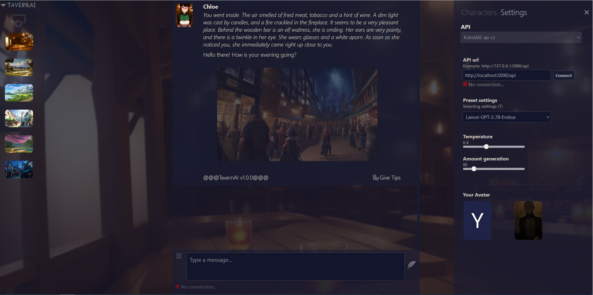
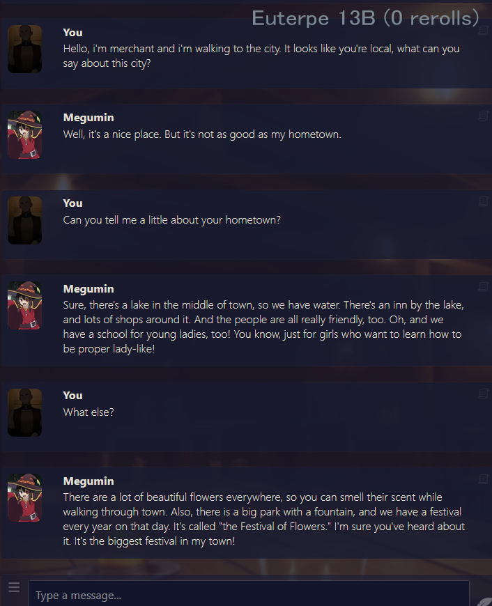
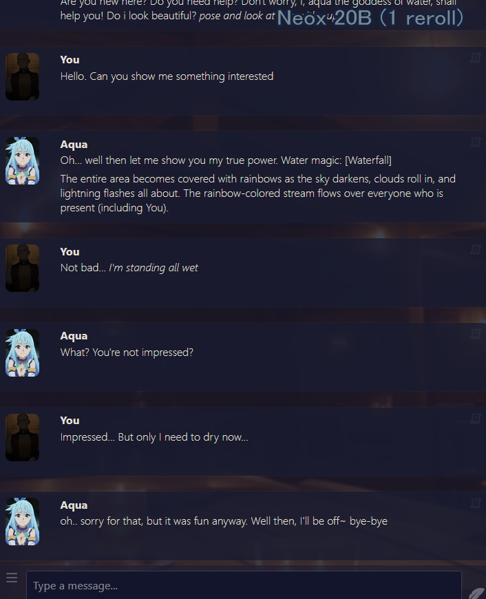
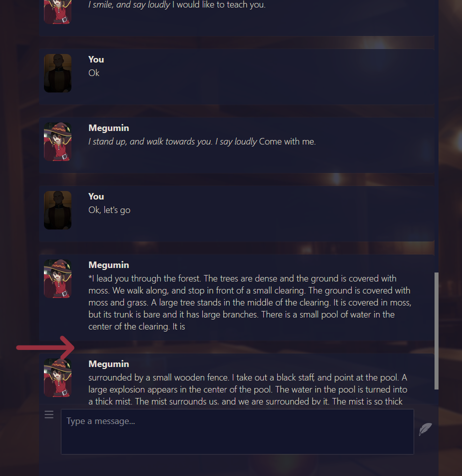

### TavernAI is a adventure atmospheric chat (KoboldAI, NovelAI, Pygmalion)
Examples of interface and output:
 

[@@@Download TavernAI@@@](https://github.com/TavernAI/TavernAI/archive/refs/heads/main.zip) (Last version)  
[TavernAI Run Online](https://colab.research.google.com/github/TavernAI/TavernAI/blob/main/colab/GPU.ipynb)  
[TavetnAI Boosty](https://boosty.to/tavernai) 
[TavernAI Discord](https://discord.gg/zmK2gmr45t) 

## Features
* Creating characters with personality setup
* Choosing name and avatar for your character
* Deleting and regenerating messages
* Editing any messages
* Works with various ai models
* Importing chats from CAI
* More longer messages from characters
* Choosing atmospheric backgrounds
* Creating and easy choosing preset settings

## How to install
### In Detail:
* [Install with KoboldAI](https://github.com/TavernAI/TavernAI/wiki/How-to-install) 
* [Install with NovelAI](https://github.com/TavernAI/TavernAI/wiki/How-to-install-Novel) 
### Briefly:
1. Download [TavernAI](https://github.com/TavernAI/TavernAI/archive/refs/heads/main.zip)
2. Install [Node.js v19.1.0](https://nodejs.org/download/release/v19.1.0/)
3. Run Start.bat (or use command: *npm install*, *node server.js*)
## AI Models
* [KoboldAI](https://github.com/KoboldAI/KoboldAI-Client)
* [NovelAI](https://novelai.net/)
* [Pygmalion](https://rentry.org/pygmalion-ai)

## Tips
Use this button to edit the message  
  
If the message is not finished, you can simply send the request again, TavernAI will understand that this is a continuation.  (Works with KoboldAI and NovelAI models, not with Pygmalion) 
 
## Additional materials
https://www.reddit.com/user/Crataco/comments/zuowi9/opensource_chatbot_companions/
## For contacts
* Discord: Humi#5044
## For thanks and support
TavernAI is being developed with love and care on a voluntary basis. If you like the project and want to support it, your donation would make a huge impact!

BTC 1LASziomyYNkZ2zk8Sa4ZLTkvczBMrjyjP 
ETH 0x975E5C91042ce8168B3d37b17F99949c5eFB3Dfe 
TRX TCiBKCt6xEGrsjpgQA2jDXWJLyUh1KN2Sn
   
